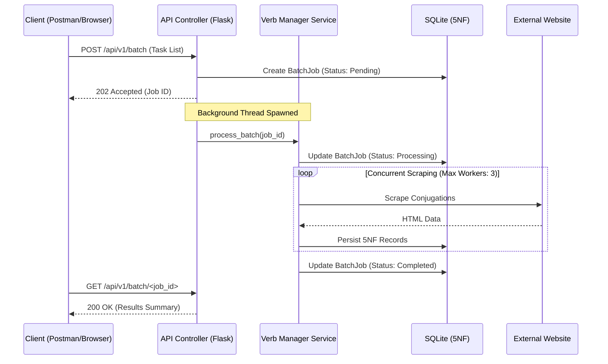

# Verb Scraper App


[](https://github.com/DaSteff91/verb-scraper-app/releases)

[](https://github.com/psf/black)
[](https://www.kite-engineer.de)

## Summary

The Verb Scraper App is a web application and RESTful API for extracting and normalizing Portuguese verb conjugations. The system automates the transition from unstructured HTML data to a relational SQLite database (5NF) and generates structured CSV exports for tools like Anki.

## System Architecture

### Asynchronous Data Flow

The application implements a "Restaurant Pager" pattern for batch requests. This ensures the API remains responsive while long-running scraping tasks execute in background threads.



### Directory Structure

```text
verb-scraper-app/
├── .github/                # CI/CD workflows for testing and deployment
├── instance/               # Persistent SQLite storage and health check markers
├── src/                    # Application source code
│   ├── models/             # SQLAlchemy 5NF schema (Verbs, Modes, Tenses, Persons, Conjugations)
│   ├── routes/             # Flask Blueprints (Web UI and REST API v1)
│   ├── services/           # Logic for auth, scraping, batching, and CSV generation
│   ├── templates/          # Jinja2 templates using Alpine.js for frontend logic
│   ├── config.py           # Fail-fast configuration loading
│   └── __init__.py         # App factory and logger initialization
├── tests/                  # Pytest suite (Unit, Integration, and Remote Contract tests)
├── Dockerfile              # Multi-stage production image
├── docker-compose.yml      # Local and production service orchestration
└── run.py                  # Entry point for WSGI servers
```

## Detailed Features

- **Grammatical Coverage:**
  - Full support for all 6-person paradigms (Eu, Tu, Ele, Nós, Vós, Eles).
  - Handles irregular verb structures (e.g., _pôr_, _ir_) via scoped DOM traversal.
  - Includes a whitelist-based validator for grammatical Modes and Tenses.
- **Data Integrity & Persistence:**
  - **5th Normal Form (5NF) Database:** Minimizes redundancy by separating grammatical metadata from verb instances.
  - **Atomic Transactions:** Ensures database consistency during multi-threaded batch writes.
  - **Automated Janitor:** Self-cleaning logic for background job records to prevent database bloat.
- **API & Backend Logic:**
  - **Threaded Batch Engine:** Concurrent scraping using `ThreadPoolExecutor` with a configurable worker pool.
  - **Asynchronous Jobs:** UUID-based job tracking for non-blocking API interactions.
  - **Diagnostic Health Checks:** Endpoint for verifying DB connectivity, filesystem write permissions, and system seeding status.
  - **Dialect Normalization:** Automatic filtering of second-person forms (_tu_/_vós_) for Brazilian Portuguese study requirements.
- **User Interface:**
  - **Scrape Basket:** Alpine.js-powered frontend for building batch requests locally before submission.
  - **Dynamic Results Dashboard:** Accordion-style views for reviewing batch results.
- **Export Capabilities:**
  - **Anki Integration:** CSV generation using byte-streams with UTF-8-SIG encoding for direct import into flashcard software.
  - **Native Formatting:** Supports newline-separated values within CSV fields for card styling.

## API Documentation

### Authentication

Include the following header in all requests:
`X-API-KEY: <your_configured_key>`

### Endpoints

- `GET /api/v1/verbs/<infinitive>`: Retrieve stored conjugations.
  - `dialect=br|pt`: Filter out 2nd person forms.
  - `anki=true`: Return a formatted CSV string in the JSON response.
- `POST /api/v1/scrape`: Synchronous trigger for a single verb/mode/tense combination.
- `POST /api/v1/batch`: Submit a list of tasks for background processing. Returns 202 and a Job ID.
- `GET /api/v1/batch/<job_id>`: Check progress of a background task.
- `GET /api/v1/health`: System diagnostic report.

## Local Development Setup

### 1. Environment Initialization

```bash
python -m venv .venv
source .venv/bin/activate
pip install -r requirements.txt
```

### 2. Configuration

Create a `.env` file in the root:

```text
SECRET_KEY=your_secret_string
API_KEY=your_api_token
LOG_LEVEL=DEBUG
```

### 3. Execution

```bash
python run.py
```

## Production Deployment

### Docker Orchestration

The production environment uses Gunicorn behind a containerized setup.

```bash
docker compose up -d --build
```

## Quality & Engineering Standards

- **Testing:** CI/CD pipeline executes Unit tests, Integration tests, and "Contract Tests" that verify the scraper against the live external website structure.
- **Versioning:** Automated semantic versioning and GitHub release generation based on commit history.
- **Typing:** PEP 484 type annotations enforced for all core modules.
- **Security:** Header-based API authentication and input sanitization to prevent injection and SSRF.

## Live Version

[conjugator.kite-engineer.de](https://conjugator.kite-engineer.de)

## Contact

Stefan Merthan (Kite-Engineer)
[www.kite-engineer.de](https://www.kite-engineer.de)
