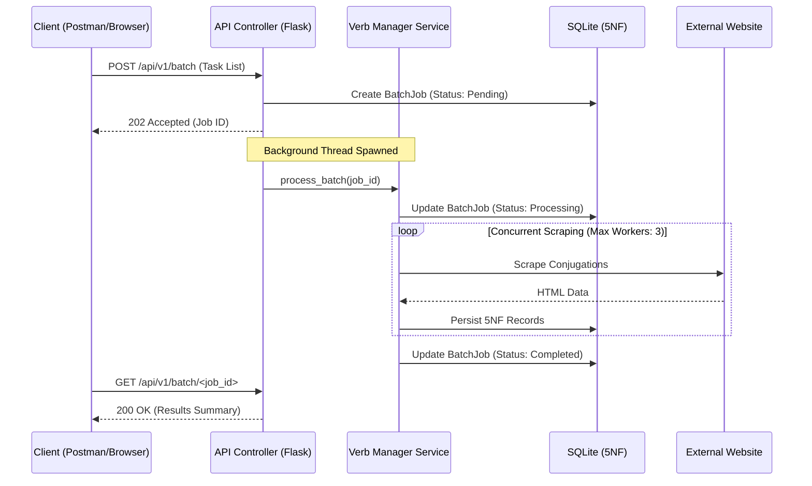

# Verb Scraper App


[](https://github.com/DaSteff91/verb-scraper-app/releases)
[](https://psf/black)
[](https://www.kite-engineer.de)

## Summary

The Verb Scraper App is a web application and RESTful API
designed to automate the extraction, normalization, and persistence of
Portuguese verb conjugations. The system leverages an asynchronous multi-threaded
orchestrator and a 5th Normal Form (5NF) SQLite schema to provide structured
data for study tools such as Anki.

## System Architecture

### Asynchronous Data Flow

The application utilizes a Non-Blocking "Restaurant Pager" pattern for batch
requests to ensure API responsiveness and server stability.



### Directory Structure

```text
verb-scraper-app/
├── .github/                # CI/CD Workflows
├── instance/               # Local SQLite storage (excluded from Git)
├── src/                    # Source code
│   ├── models/             # Database Schema (SQLAlchemy 5NF)
│   │   └── verb.py         # Verb, Mode, Tense, Person, Conjugation, BatchJob
│   ├── routes/             # Controllers (Flask Blueprints)
│   │   ├── main.py         # Web Interface routes
│   │   └── api.py          # REST API v1 routes
│   ├── services/           # Business Logic
│   │   ├── auth.py         # API Key Authentication Decorator
│   │   ├── scraper.py      # BeautifulSoup scoping logic
│   │   ├── verb_manager.py # Threaded batch orchestration
│   │   ├── exporter.py     # Anki CSV generation (Native CSV)
│   │   └── validator.py    # Input and Batch validation
│   ├── templates/          # Jinja2 Templates (Dashboard & Accordion)
│   ├── config.py           # Environment-based configuration (Fail-Fast)
│   └── __init__.py         # Application Factory
├── tests/                  # Pytest suite (Unit, Integration, Contract)
├── Dockerfile              # Lean image (Python 3.13-slim)
└── docker-compose.yml      # Orchestration (Single worker, multi-threaded)
```

## Features

- Asynchronous Batch Processing: Concurrent scraping via ThreadPoolExecutor.
- Secure REST API: Header-based authentication (X-API-KEY).
- Regional Dialect Support: Automatically filters 2nd person (tu/vós) by default
  for Brazilian Portuguese.
- Dual Frontend: Responsive Bootstrap 5 / Alpine.js dashboard and a headless API.
- Memory Optimized: Lazy-loading services keep the idle footprint under 60MB.

## API Documentation

### Authentication

All API requests require the following header:
`X-API-KEY: <your_configured_key>`

### Endpoints

| Method | Endpoint              | Description                                                    |
| :----- | :-------------------- | :------------------------------------------------------------- |
| GET    | `/api/v1/verbs/<inf>` | Get conjugations. Supports `?dialect=br\|pt` and `?anki=true`. |
| POST   | `/api/v1/scrape`      | Trigger a single-verb scrape. Returns 201 Created.             |
| POST   | `/api/v1/batch`       | Trigger background batch scrape. Returns 202 Accepted.         |
| GET    | `/api/v1/batch/<id>`  | Poll status of a background job.                               |

## Local Development Setup

1. Create a `.env` file:

```text
SECRET_KEY=generate_a_random_string
API_KEY=your_secure_api_token
```

2. Build and launch:

```bash
docker compose up -d --build
```

## Quality Standards

- Enforced PEP 484 type hinting (Pylance/Mypy compatible).
- Global JSON error handling for 100% API reliability.
- Automated Job Janitor for database maintenance.

## License

Distributed under the MIT License.

## Contact

Kite-Engineer - by Stefan Merthan
Website: www.kite-engineer.de
