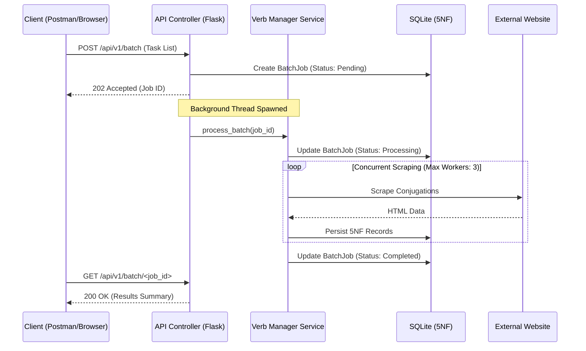

# Verb Scraper App


[](https://github.com/DaSteff91/verb-scraper-app/releases)
[](https://github.com/DaSteff91/verb-scraper-app)
[](https://github.com/psf/black)
[](https://www.kite-engineer.de)

## Summary

The Verb Scraper App is a high-performance web application and RESTful API designed to automate the extraction, normalization, and persistence of Portuguese verb conjugations. Built with a focus on data integrity and software lifecycle management, the application provides a seamless pipeline from concurrent web scraping to SQLite persistence (5NF) and structured CSV export optimized for study tools such as Anki.

## System Architecture

### Asynchronous Data Flow

The application utilizes a Non-Blocking "Restaurant Pager" pattern for batch requests to ensure API responsiveness and server stability during long-running scraping tasks.



### Directory Structure

```text
verb-scraper-app/
├── .github/                # CI/CD Workflows
├── instance/               # Local SQLite storage (excluded from Git)
├── src/                    # Source code
│   ├── models/             # Database Schema (SQLAlchemy 5NF)
│   │   └── verb.py         # Verb, Mode, Tense, Person, Conjugation, BatchJob
│   ├── routes/             # Controllers (Flask Blueprints)
│   │   ├── main.py         # Web Interface routes
│   │   └── api.py          # REST API v1 routes
│   ├── services/           # Business Logic
│   │   ├── auth.py         # API Key Authentication Decorator
│   │   ├── scraper.py      # BeautifulSoup scoping logic
│   │   ├── verb_manager.py # Threaded batch orchestration
│   │   ├── exporter.py     # Anki CSV generation (Native CSV)
│   │   └── validator.py    # Input and Batch validation
│   ├── templates/          # Jinja2 Templates (Dashboard & Accordion)
│   ├── config.py           # Environment-based configuration (Fail-Fast)
│   └── __init__.py         # Application Factory
├── tests/                  # Pytest suite
├── Dockerfile              # Production slim image configuration
├── docker-compose.yml      # Local and production orchestration
└── run.py                  # WSGI entry point
```

## Features

- Full 6-Person Paradigm: Supports the complete Portuguese conjugation set.
- Regional Dialect Support: Automatically filters 2nd person (tu/vós) by default for Brazilian Portuguese.
- Dynamic UI Logic: Alpine.js "Scrape Basket" with multi-select highlighter pills.
- Asynchronous Batch Processing: Concurrent scraping via ThreadPoolExecutor.
- Secure REST API: Header-based authentication (X-API-KEY).
- Anki Integration: Optimized CSV generation using native Python byte-streams.
- Memory Optimized: Lazy-loading services keep the idle footprint under 60MB.

## API Documentation

### Authentication

All API requests require the following header:
`X-API-KEY: <your_configured_key>`

### Endpoints

| Method | Endpoint              | Description                                                    |
| :----- | :-------------------- | :------------------------------------------------------------- |
| GET    | `/api/v1/verbs/<inf>` | Get conjugations. Supports `?dialect=br\|pt` and `?anki=true`. |
| POST   | `/api/v1/scrape`      | Trigger a single-verb scrape. Returns 201 Created.             |
| POST   | `/api/v1/batch`       | Trigger background batch scrape. Returns 202 Accepted.         |
| GET    | `/api/v1/batch/<id>`  | Poll status of a background job.                               |

## Local Development Setup

### 1. Clone the Repository

```bash
git clone https://github.com/DaSteff91/verb-scraper-app.git
cd verb-scraper-app
```

### 2. Environment Setup

```bash
python -m venv .venv
source .venv/bin/activate
pip install -r requirements.txt
```

### 3. Configuration

Create a `.env` file in the root directory:

```text
FLASK_APP=run.py
FLASK_DEBUG=1
SECRET_KEY=your_flask_secret
API_KEY=your_secure_api_token
```

### 4. Launch the Application

```bash
python run.py
```

## Production Deployment

### Docker Orchestration

The application is optimized for containerized environments using a non-privileged user and a single-worker, multi-threaded Gunicorn configuration. To build and launch the container:

```bash
docker compose up -d --build
```

## Quality Standards

- Type Hinting: Strictly enforced PEP 484 annotations (Pylance/Mypy compatible).
- Error Handling: Global JSON error handling for 100% API reliability.
- Maintenance: Automated Job Janitor for database record lifecycle management.
- Documentation: Google-style docstrings for all modules.
- Linting: Configured for Black, Flake8, and Mypy.

## License

Distributed under the MIT License. See `LICENSE` for more information.

## Live version

[conjugator.kite-engineer.de](https://conjugator.kite-engineer.de)

## Contact

Kite-Engineer - by Stefan Merthan
Website: [www.kite-engineer.de](https://www.kite-engineer.de)  
Project Link: [https://github.com/DaSteff91/verb-scraper-app](https://github.com/DaSteff91/verb-scraper-app)
