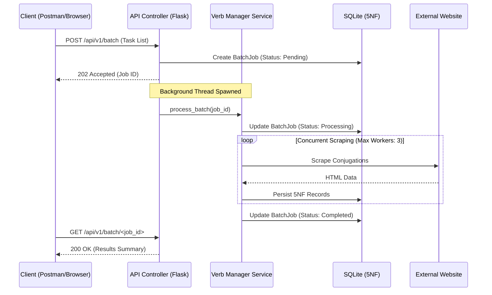

# Portuguese Conjugation Scraper App


[](https://github.com/DaSteff91/verb-scraper-app/releases)

[](https://github.com/psf/black)
[](https://www.kite-engineer.de)

## Summary

The Portuguese Conjugation Scraper App is a web application and RESTful API for extracting and normalizing Portuguese verb conjugations. The system automates the transition from unstructured HTML data to a relational SQLite database (5NF) and generates structured CSV exports for tools like Anki.

## System Architecture

### Asynchronous Data Flow

The application implements a "Restaurant Pager" pattern for batch requests. This ensures the API remains responsive while long-running scraping tasks execute in background threads.



### Directory Structure

```text
verb-scraper-app/
├── .github/                # CI/CD workflows for testing and deployment
├── instance/               # Persistent SQLite storage and health check markers
├── src/                    # Application source code
│   ├── models/             # SQLAlchemy 5NF schema (Verbs, Modes, Tenses, Persons, Conjugations)
│   ├── routes/             # Flask Blueprints (Web UI and REST API v1)
│   ├── services/           # Logic for auth, scraping, batching, and CSV generation
│   ├── templates/          # Jinja2 templates using Alpine.js for frontend logic
│   ├── config.py           # Fail-fast configuration loading
│   └── __init__.py         # App factory and logger initialization
├── tests/                  # Pytest suite (Unit, Integration, and Remote Contract tests)
├── Dockerfile              # Multi-stage production image
├── docker-compose.yml      # Local and production service orchestration
└── run.py                  # Entry point for WSGI servers
```

## Detailed Features

- **Grammatical Coverage:**
  - Full support for all 6-person paradigms (Eu, Tu, Ele, Nós, Vós, Eles).
  - Handles irregular verb structures (e.g., _pôr_, _ir_) via scoped DOM traversal.
  - Includes a whitelist-based validator for grammatical Modes and Tenses.
- **Data Integrity & Persistence:**
  - **5th Normal Form (5NF) Database:** Minimizes redundancy by separating grammatical metadata from verb instances.
  - **Atomic Transactions:** Ensures database consistency during multi-threaded batch writes.
  - **Automated Janitor:** Self-cleaning logic for background job records to prevent database bloat.
- **API & Backend Logic:**
  - **Threaded Batch Engine:** Concurrent scraping using `ThreadPoolExecutor` with a configurable worker pool.
  - **Asynchronous Jobs:** UUID-based job tracking for non-blocking API interactions.
  - **Diagnostic Health Checks:** Endpoint for verifying DB connectivity, filesystem write permissions, and system seeding status.
  - **Dialect Normalization:** Automatic filtering of second-person forms (_tu_/_vós_) for Brazilian Portuguese study requirements.
- **User Interface:**
  - **Scrape Basket:** Alpine.js-powered frontend for building batch requests locally before submission.
  - **Dynamic Results Dashboard:** Accordion-style views for reviewing batch results.
- **Export Capabilities:**
  - **Anki Integration:** CSV generation using byte-streams with UTF-8-SIG encoding for direct import into flashcard software.
  - **Native Formatting:** Supports newline-separated values within CSV fields for card styling.

## API Documentation (v1)

The API allows for programmatic access to the verb database and the scraping engine. All endpoints require a valid API Key.

### Authentication

All requests must include the following header: `X-API-KEY: <your_api_key>`
For the public available version just contact me [stefan@kite-engineer.de](stefan@kite-engineer.de)

---

### Endpoints

#### 1. Retrieve Stored Conjugations

`GET /api/v1/verbs/<infinitive>`

Fetches data currently stored in the local database.

| Parameter | Type    | Default | Description                                       |
| :-------- | :------ | :------ | :------------------------------------------------ |
| `mode`    | string  | `null`  | Filter by mode (e.g., `Indicativo`).              |
| `tense`   | string  | `null`  | Filter by tense (e.g., `Presente`).               |
| `dialect` | string  | `br`    | `br` (skips tu/vós) or `pt` (includes all).       |
| `anki`    | boolean | `false` | Set `true` to include a pre-formatted CSV string. |

**Example Request:**

```bash
curl -H "X-API-KEY: my_secret_token" \
     "https://conjugator.kite-engineer.de/api/v1/verbs/comer?mode=Indicativo&tense=Presente&dialect=pt&anki=true"
```

**Example Response:**

```json
{
  "infinitive": "comer",
  "dialect": "European (standard)",
  "scraped_at": "2026-01-22T16:55:00Z",
  "conjugations": [
    {
      "person": "eu",
      "value": "eu como",
      "mode": "Indicativo",
      "tense": "Presente"
    },
    {
      "person": "tu",
      "value": "tu comes",
      "mode": "Indicativo",
      "tense": "Presente"
    }
    /* ... rest of the forms */
  ],
  "anki_string": "\"comer\",\"eu como\\ntu comes...\",\"Indicativo Presente\""
}
```

---

#### 2. Trigger Synchronous Scrape

`POST /api/v1/scrape`

Forces the server to scrape a specific verb/mode/tense combination immediately.

**Example Request:**

```bash
curl -X POST -H "X-API-KEY: my_secret_token" \
     -H "Content-Type: application/json" \
     -d '{"verb": "falar", "mode": "Indicativo", "tense": "Presente"}' \
     "https://conjugator.kite-engineer.de/api/v1/scrape"
```

---

#### 3. Submit Asynchronous Batch

`POST /api/v1/batch`

Submits multiple verbs for background processing. Returns a `job_id` for tracking.

**Example Request:**

```bash
curl -X POST -H "X-API-KEY: my_secret_token" \
     -H "Content-Type: application/json" \
     -d '{
           "tasks": [
             {"verb": "ir", "mode": "Subjuntivo", "tense": "Futuro"},
             {"verb": "sentir", "mode": "Indicativo", "tense": "Presente"}
           ]
         }' \
     "https://conjugator.kite-engineer.de/api/v1/batch"
```

**Response (202 Accepted):**

```json
{
  "status": "accepted",
  "job_id": "550e8400-e29b-41d4-a716-446655440000",
  "check_status_url": "/api/v1/batch/550e8400-e29b-41d4-a716-446655440000"
}
```

---

#### 4. Check Batch Status

`GET /api/v1/batch/<job_id>`

Polls the progress of a background job.

**Example Request:**

```bash
curl -H "X-API-KEY: my_secret_token" \
     "https://conjugator.kite-engineer.de/api/v1/batch/550e8400-e29b-41d4-a716-446655440000"
```

**Response:**

```json
{
  "job_id": "550e8400-e29b-41d4-a716-446655440000",
  "status": "processing",
  "progress": {
    "total": 2,
    "success": 1,
    "failed": 0
  },
  "created_at": "2026-01-22T17:00:00Z"
}
```

---

#### 5. Health Check

`GET /api/v1/health`

Returns diagnostic info about DB connectivity and storage.

**Example Response:**

```json
{
  "status": "healthy",
  "checks": {
    "database": "ok",
    "storage": "ok",
    "readiness": "ok"
  }
}
```

### Data Constraints & Supported Grammar

To ensure successful scraping and database integrity, all inputs are passed through a strict validation layer.

#### 1. Verb Formatting Rules

When providing a verb (the `infinitive` parameter), it must adhere to the following:

- **Form:** Must be the **infinitive** form (e.g., `falar`, not `falo`).
- **Characters:** Supports standard Portuguese letters, including accents (`á`, `ê`, `í`, `õ`) and the cedilla (`ç`).
- **Reflexives:** Hyphens are permitted for reflexive verbs (e.g., `pôr-se`).
- **Length:** Maximum of **20 characters**.
- **Prohibited:** No numbers, symbols, or special characters (e.g., `!`, `@`, `#`, `$`, `.`, `/`).

#### 2. Supported Grammatical Modes & Tenses

The `mode` and `tense` parameters must exactly match the whitelist below (case-sensitive):

| Mode (`mode`)  | Available Tenses (`tense`)                                                                                                           |
| :------------- | :----------------------------------------------------------------------------------------------------------------------------------- |
| **Indicativo** | `Presente`, `Pretérito Imperfeito`, `Pretérito Perfeito`, `Pretérito Mais-que-perfeito`, `Futuro do Presente`, `Futuro do Pretérito` |
| **Subjuntivo** | `Presente`, `Pretérito Imperfeito`, `Futuro`                                                                                         |
| **Imperativo** | `Afirmativo`, `Negativo`                                                                                                             |

> **Note:** If a requested mode/tense combination does not exist on the external provider for a specific irregular verb, the API will return a `500` error (via Scrape) or a `fail` count (via Batch).

## Local Development Setup

### 1. Environment Initialization

```bash
python -m venv .venv
source .venv/bin/activate
pip install -r requirements.txt
```

### 2. Configuration

Create a `.env` file in the root:

```text
SECRET_KEY=your_secret_string
API_KEY=your_api_token
LOG_LEVEL=DEBUG
```

### 3. Execution

```bash
python run.py
```

## Production Deployment

### Docker Orchestration

The production environment uses Gunicorn behind a containerized setup.

```bash
docker compose up -d --build
```

## Quality & Engineering Standards

- **Testing:** CI/CD pipeline executes Unit tests, Integration tests, and "Contract Tests" that verify the scraper against the live external website structure.
- **Versioning:** Automated semantic versioning and GitHub release generation based on commit history.
- **Typing:** PEP 484 type annotations enforced for all core modules.
- **Security:** Header-based API authentication and input sanitization to prevent injection and SSRF.

## Live Version

[conjugator.kite-engineer.de](https://conjugator.kite-engineer.de)

## Bulk Operations & Tooling

The project includes a standalone script, the **Bulk Importer Tool** designed for large-scale data ingestion and automated Anki deck generation via .csv export of the provided tool.

### Bulk Importer Script

Located at `scripts/api_tools/bulk_importer.py`, this tool allows you to process hundreds of verbs automatically by driving the API's batch engine.

#### Key Features:

- **Matrix Generation:** Automatically expands a single verb into all 11 supported grammatical combinations (Indicativo, Subjuntivo, Imperativo).
- **Sequential Processing:** Handles verbs in configurable "epochs" to ensure server stability and bypass request size limits.
- **Local Merging:** Consolidates multiple API responses into a single, unified CSV file.
- **Anki Optimization:** Exports files with `UTF-8-SIG` encoding and normalized tags (e.g., `Indicativo-Presente`) for seamless flashcard import.

#### Usage:

1. Ensure your `.env` file contains a valid `API_KEY` and `BASE_URL`.
2. Place your verbs in a comma-separated text file: `scripts/api_tools/295_irregular_portuguese_verbs.txt`.
3. Run the script from the project root:

```bash
export PYTHONPATH=$PYTHONPATH:.
python3 scripts/api_tools/bulk_importer.py
```

#### Configuration:

Within the script's `main` block, you can adjust the intensity:

- `verbs_per_batch=10`: Recommended for local development.
- `verbs_per_batch=20`: Optimized for production server environments.

---

### Directory Layout for Tools

```text
scripts/
├── exports/
├── api_tools/
│   ├── bulk_importer.py       # API Client Orchestrator
│   └── irregular_verbs.txt    # Data source for bulk runs
```

## Contact

Stefan Merthan (Kite-Engineer)
[www.kite-engineer.de](https://www.kite-engineer.de)
