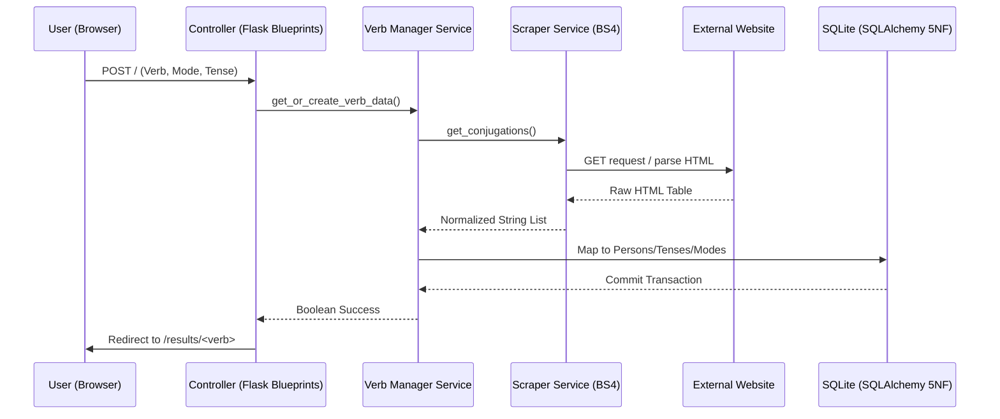

# Verb Scraper App

## Summary

The Verb Scraper App is a web application designed to automate the extraction, normalization, and persistence of Portuguese verb conjugations. Built with a focus on data integrity and software lifecycle management, the application provides a seamless pipeline from web scraping to SQLite persistence (5NF) and structured CSV export optimized for study tools such as [Anki(https://apps.ankiweb.net/)].

## System Architecture

### Data Flow Diagram

The following diagram illustrates the lifecycle of a scraping request within the Model-View-Controller (MVC) framework:



### Directory Structure

```text
verb-scraper-app/
├── .github/                # CI/CD Workflows
│   └── workflows/
│       └── release.yml     # Automated SemVer, Build, and Deploy
├── instance/               # Local SQLite storage (excluded from Git)
├── src/                    # Source code
│   ├── models/             # Database Schema (SQLAlchemy 5NF)
│   │   ├── __init__.py
│   │   └── verb.py         # Verb, Mode, Tense, Person, Conjugation
│   ├── routes/             # Controllers (Flask Blueprints)
│   │   └── main.py
│   ├── services/           # Business Logic
│   │   ├── scraper.py      # BeautifulSoup scoping logic
│   │   ├── verb_manager.py # Orchestrates DB/Scraper interaction
│   │   └── exporter.py     # CSV/Anki generation logic
│   ├── static/             # Frontend assets (CSS/JS)
│   ├── templates/          # Views (Jinja2 Templates)
│   │   ├── base.html       # Master layout
│   │   ├── index.html      # Search dashboard
│   │   └── results.html    # Filtered data view
│   ├── config.py           # Environment-based configuration
│   ├── extensions.py       # Extension initialization (SQLAlchemy)
│   └── __init__.py         # Application Factory (versioning source)
├── tests/                  # Pytest suite
├── Dockerfile              # Production slim image configuration
├── docker-compose.yml      # Local and production orchestration
├── pyproject.toml          # Build system and linting settings
├── requirements.txt        # Managed dependencies
└── run.py                  # WSGI entry point
```

## Core Design Principles

### Model-View-Controller (MVC)

The application maintains strict separation of concerns to ensure testability and scalability:

- **Model:** Uses SQLAlchemy 2.0 with a 5th Normal Form (5NF) relational schema to eliminate data redundancy.
- **View:** Implements a responsive Bootstrap 5 interface with dynamic Jinja2 injection.
- **Controller:** Utilizes Flask Blueprints to handle routing and input sanitization.

### Advanced Scraping Logic

The scraping engine solves the "nested span" and "duplicate header" issues common in irregular verb pages. It employs parent-container scoping to isolate the correct grammatical mode before searching for specific tenses. A double-clean normalization process ensures that inconsistent HTML whitespace is condensed into single-spaced, human-readable strings.

## Features

- **Full 6-Person Paradigm:** Supports the complete Portuguese conjugation set.
- **Dynamic UI Logic:** JavaScript-driven dependent dropdowns ensure users only select valid mode-tense combinations.
- **Anki Integration:** Optimized CSV generation with UTF-8-SIG encoding and a toggle to skip the 2nd person (tu/vós) according to user study preferences.
- **Stateless Execution:** CSV files are generated in-memory (RAM) using Byte-streams, making the application ideal for containerized environments.

## Deployment and Automation

### Continuous Integration/Deployment

The project features a full CI/CD pipeline via GitHub Actions:

1.  **Versioning:** Conventional Commits trigger automated Semantic Versioning.
2.  **Containerization:** Automated builds of Python 3.13-slim images.
3.  **GHCR:** Images are hosted on the GitHub Container Registry.
4.  **Automatic Deployment:** Successful builds trigger an SSH action to update the production environment on Ubuntu 24.04.

### Docker Production Setup

The container runs as a non-privileged user and is served by Gunicorn with multi-worker concurrency.
To deploy locally:

```bash
docker compose up -d --build
```

## Local Development Setup

Follow these steps to get a local development environment running on Linux or macOS.

### 1. Clone the Repository

```bash
git clone https://github.com/DaSteff91/verb-scraper-app.git
cd verb-scraper-app
```

### 2. Environment Setup

Create and activate a virtual environment using Python 3.13+:

```bash
python -m venv .venv
source .venv/bin/activate
```

### 3. Install Dependencies

```bash
pip install --upgrade pip
pip install -r requirements.txt
```

### 4. Configuration

Create a local `.env` file with default development settings:

```bash
cat <<EOF > .env
FLASK_APP=run.py
FLASK_DEBUG=1
SECRET_KEY=$(python -c 'import secrets; print(secrets.token_hex())')
EOF
```

### 5. Launch the Application

```bash
python run.py
```

The application will be available at `http://127.0.0.1:5000`.

## Production Deployment

### Docker Orchestration

The application is optimized for containerized environments using a non-privileged user and multi-worker Gunicorn. To build and launch the production container locally:

```bash
docker compose up -d --build
```

### Quality Standards

- **Type Hinting:** Strictly enforced PEP 484 annotations.
- **Documentation:** Google-style docstrings for all modules and classes.
- **Linting:** Configured for Black, Flake8, and Mypy.

## Roadmap

- **Test Suite:** Automated unit testing for scraping edge cases.
- **Library Browser:** Global dashboard for searching and managing all persisted verbs.
- **Batch Operations:** Bulk scraping and multi-CSV export features.

## License

Distributed under the MIT License. See `LICENSE` for more information.

## Contact

**Kite-Engineer** - by Stefan Merthan
Website: [www.kite-engineer.de](http://www.kite-engineer.de)  
Project Link: [https://github.com/DaSteff91/verb-scraper-app](https://github.com/DaSteff91/verb-scraper-app)
